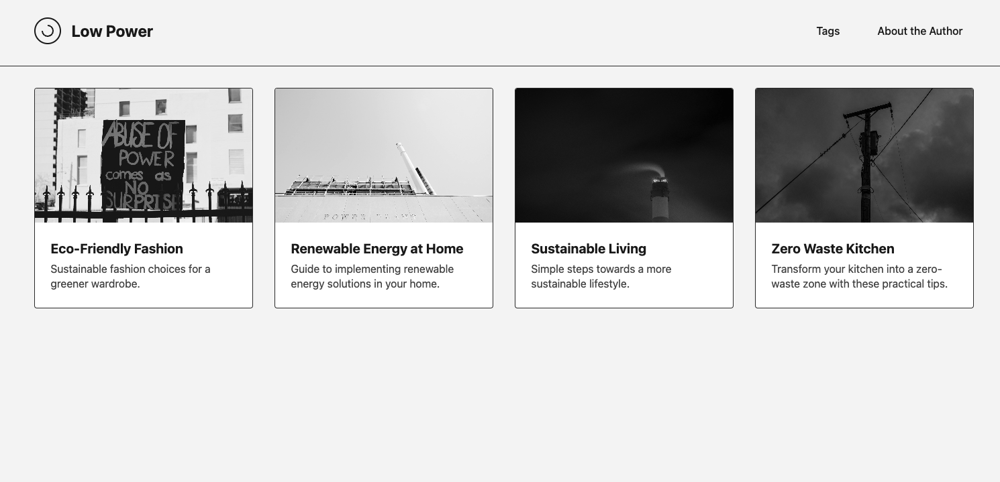
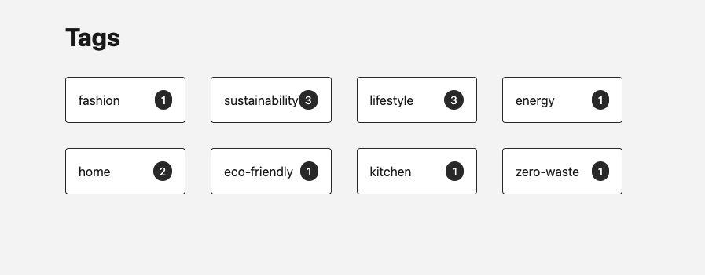
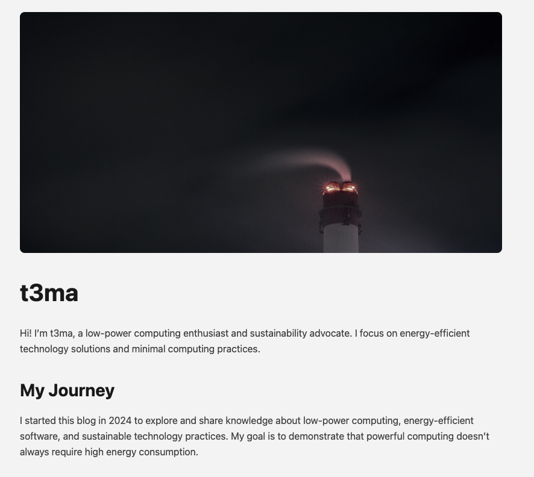

# Low Power Blog

A minimalist blog template focused on energy efficiency and low-power computing. Built with Astro and designed to be lightweight and performant.




## Features

- Minimalist monochrome design
- Lightweight and fast loading
- Content collections for blog posts and pages
- Tag system for content organization
- Responsive grid layout
- Energy-efficient grayscale images
- Used astro-imagetools

## Getting Started

```bash
npm install
npm run dev
npm run build  
npm run preview
```

## Content Structure

- `/src/content/blog/` - Blog posts
- `/src/content/page/` - Static pages
- `/public/images/` - Image assets

## License

This project is licensed under the MIT License - see the LICENSE file for details.
